# CHCNAV ROS2-Galactic 驱动

本驱动（`chcnav` 功能包）用于接入华测导航 CGI 系列组合导航设备：通过 **串口 / TCP / UDP / CAN / 文件** 读取设备输出的混合协议数据（华测 CGI 自定义二进制协议 + NMEA 协议），完成分类、校验与解析，并发布为 ROS2 话题；同时支持通过 NTRIP 在设备无网络时转发差分数据辅助固定。

| 版本   | 更改说明                                     | 更改人 | 日期       |
| ------ | -------------------------------------------- | ------ | ---------- |
| V0.4   | 初版                                         | 吴其荣 | 2023-04-10 |
| V0.4.1 | 更新 udp 文档                                | 吴其荣 | 2023-04-18 |
| V0.4.2 | 更新环境准备文档                             | 张小镛 | 2023-08-16 |
| V1.0.0 | ROS2 使用说明文档                            | 张小镛 | 2023-10-09 |
| V1.0.3 | 支持 galactic 版本及 arm 架构                | 程彦淇 | 2025-12-05 |
| V1.0.4 | 修复 demo 6 无法登录 cors 的问题             | 王延祥 | 2026-05-12 |
| V1.0.5 | README文档重构，修改 devimu 加速度的变量名称 | 王延祥 | 2026-07-13 |

---

## 目录

- [1. 快速开始](#1-快速开始)
- [2. 话题说明](#2-话题说明)
- [3. 设备端配置](#3-设备端配置)
- [4. 运行示例（demo）](#4-运行示例demo)
- [5. 坐标系与角度约定](#5-坐标系与角度约定)
- [6. 时间戳说明](#6-时间戳说明)
- [7. 常见问题排查](#7-常见问题排查)
- [附录](#附录)

---

## 1. 快速开始

### 1.1 前置条件

- 已安装 ROS2 Galactic（推荐 `ros-galactic-desktop`；`ros-base` 缺少部分依赖，需自行补装）。环境搭建见 [附录 A](#附录-aros2-galactic-环境搭建)。
- 设备已按 [3. 设备端配置](#3-设备端配置) 开启协议输出（推荐：`HCINSPVATZCB`、`GPCHC`、`GPGGA`）。

### 1.2 编译

```shell
# 解压源码包
tar -zxvf ./galactic-chcnav-cgi_ros2pkg_v1.0.5.tar.gz
# 进入工作空间根目录
cd galactic-chcnav-cgi_ros2pkg_v1.0.5
# 确认存在 src 目录，其中包含 chcnav、msg_interfaces 两个功能包
ls ./src
# 编译（msg_interfaces 与 chcnav 两个包均需编译成功）
colcon build
# 导入运行环境
source ./install/setup.bash
```

### 1.3 串口权限（仅串口方式需要）

将当前用户加入 `dialout` 组（一次配置，永久生效，需重新登录）：

```shell
sudo usermod -aG dialout $USER
```

或临时授权：`sudo chmod 777 /dev/ttyUSB0`

### 1.4 运行

```shell
# 以串口 demo 为例，xml 与 py 两种 launch 格式均可
ros2 launch ./src/chcnav/launch/demo_1.xml
```

### 1.5 验证

```shell
ros2 topic list
# 应能看到：
#   /chcnav/nmea_sentence
#   /chcnav/hc_sentence
#   /chcnav/devpvt
#   /chcnav/devimu

ros2 topic echo /chcnav/devpvt     # 有持续输出即说明链路正常
```

无输出时的排查步骤见 [7. 常见问题排查](#7-常见问题排查)。

---

## 2. 话题说明

驱动从输入数据流中识别任一受支持协议并发布到对应话题（CAN 方式除外，见 [4.1](#41-demo_0can) 的声明）：

| 话题 | 协议 / 来源 | 消息类型 | 校验 / 备注 |
| --- | --- | --- | --- |
| `/chcnav/nmea_sentence` | NMEA（`$` 开头、`*XOR` 结尾，如 GPGGA / GPCHC / GPRMC） | `msg_interfaces/msg/String` | **已通过** XOR 校验 |
| `/chcnav/hc_sentence` | 华测 CGI 自定义协议（header 格式，如 HCINSPVATZCB、HCRAWIMUB） | `msg_interfaces/msg/HcSentence` | **未做** CRC32 校验（原始二进制透传） |
| `/chcnav/devpvt` | HCINSPVATZCB（组合导航数据） | `msg_interfaces/msg/Hcinspvatzcb` | **已通过** CRC32 校验 |
| `/chcnav/devimu` | HCRAWIMUIB（原始 IMU） | `msg_interfaces/msg/Hcrawimub` | **已通过** CRC32 校验 |
| `/fix` | 由 `devpvt` 转换 | `sensor_msgs/msg/NavSatFix` | **仅启动 demo_9 时发布** |
| `/imu` | 由 `devpvt` 转换 | `sensor_msgs/msg/Imu` | **仅启动 demo_9 时发布** |

说明：

- 多个解析节点（多路串口/TCP）可同时运行，数据发布到同一话题，通过 `header.frame_id`（即节点 `name`）区分来源。
- `ros2 topic echo` 默认截断超过 128 字符的字符串和超过 16 个元素的数组（末尾显示 `...`），属显示行为，数据本身完整；加 `--full-length`（简写 `-f`）参数可查看全文。
- 自定义消息话题（`/chcnav/` 下 4 个）需在 `source install/setup.bash` 后才能订阅；`/fix`、`/imu` 为 ROS 标准消息，无需 source 也可订阅。

各话题的字段说明与输出示例如下。完整字段定义见 `msg_interfaces` 包（`chcnav/msg/` 下同名文件为字段注释参考）。

### 2.1 nmea_sentence

NMEA 语句字符串，内容包含末尾校验位，不含 `\r\n`。

```
std_msgs/Header header
string sentence    # NMEA 语句，含校验位，不含 \r\n
```

输出示例（`ros2 topic echo -f /chcnav/nmea_sentence`）：

```yaml
header:
  stamp:
    sec: 1783334916
    nanosec: 104955128
  frame_id: rs232
sentence: $GPCHC,2426,125334.00,178.41,0.84,-0.01,0.01,-0.02,0.02,0.0011,-0.0027,0.9990,31.15959807,121.17847900,49.70,-0.003,0.007,-0.034,0.008,28,36,61,0,0102*4B
```

### 2.2 hc_sentence

华测 CGI 自定义协议的原始二进制串（echo 时按十进制显示）。

```
std_msgs/Header header
int16  msg_id      # 协议 id
int8[] data        # 协议原始二进制串
```

输出示例（`ros2 topic echo -f /chcnav/hc_sentence`，`data` 较长，此处截断展示）：

```yaml
header:
  stamp:
    sec: 1783334744
    nanosec: 105300582
  frame_id: rs232
msg_id: 4609
data:
- -86
- -52
- 72
- 67
- 14
- 1
- 1
- 18
- 122
- 9
- 16
- -46
- ...
```

### 2.3 devpvt（Hcinspvatzcb）

组合导航 PVT 结果。关键字段：

- 时间：`week`（GPS 周）、`second`（GPS 周内秒）
- 位置：`latitude`/`longitude`（deg）、`altitude`（m）、`position_stdev[3]`
- 姿态：`roll`/`pitch`/`yaw`（deg）及 `euler_stdev[3]`、`heading`（deg）、`heading2`（deg），角度约定见 [5. 坐标系与角度约定](#5-坐标系与角度约定)
- 速度：`speed`（地面速度）、`enu_velocity`（东北天，m/s）及 `enu_velocity_stdev[3]`、`vehicle_linear_velocity`（车辆系）
- IMU：`vehicle_angular_velocity`（车辆系角速度）、`vehicle_linear_acceleration`（车辆系加速度）、`vehicle_linear_acceleration_without_g`（车辆系加速度，无重力）、`raw_angular_velocity`（原始角速度，车辆系）、`raw_acceleration`（原始加速度，车辆系，含重力）
- 状态：`stat[0]` 组合状态（0 初始化 / 1 卫导 / 2 组合导航 / 3 纯惯导）；`stat[1]` GNSS 状态（0 不定位不定向 / 1 单点 / 2 伪距差分 / 3 组合推算 / 4 RTK 固定 / 5 RTK 浮点 / 6~9 对应不定向变体）
- 质量：`age`（差分龄期 s）、`ns`/`ns2`（主/辅天线卫星数）、`leaps`（闰秒）、`hdop`/`pdop`/`vdop`/`tdop`/`gdop`（精度因子）
- 杆臂与安装角：`ins2gnss_vector`、`ins2body_angle`（Z-X-Y 顺序旋转）、`gnss2body_vector`、`gnss2body_angle_z`
- 其它：`warning`（异常标识）、`sensor_used`（传感器使用标识）

输出示例（`ros2 topic echo /chcnav/devpvt`）：

```yaml
header:
  stamp:
    sec: 1783334320
    nanosec: 0
  frame_id: rs232
week: 2426
second: 124738.0
latitude: 31.1596001694612
longitude: 121.17847684603186
altitude: 49.7773551940918
position_stdev:
- 2.221238851547241
- 2.0861754417419434
- 2.3879024982452393
undulation: 10.531000137329102
roll: -0.09104868024587631
pitch: 0.8102092742919922
yaw: -8.303703308105469
euler_stdev:
- 10.0
- 10.0
- 2241.758056640625
speed: 0.0026421924121677876
heading: 0.0
heading2: 8.303703308105469
enu_velocity:
  x: 0.0007986590499058366
  y: -0.0025185956619679928
  z: 0.00819416344165802
enu_velocity_stdev:
- 0.014211289584636688
- 0.015717001631855965
- 0.016012882813811302
vehicle_angular_velocity:
  x: 0.0
  y: 0.0
  z: 0.0
vehicle_linear_velocity:
  x: 0.0012667716946452856
  y: -0.0023472311440855265
  z: 0.008186043240129948
vehicle_linear_acceleration:
  x: 0.0024589765816926956
  y: -0.0032717182766646147
  z: 0.9993849992752075
vehicle_linear_acceleration_without_g:
  x: 0.0
  y: 0.0
  z: 0.0
raw_angular_velocity:
  x: 0.027499999850988388
  y: -0.03500000014901161
  z: 0.012500000186264515
raw_acceleration:
  x: 0.0016309887869283557
  y: -0.002568807452917099
  z: 1.0028542280197144
stat:
- 1
- 6
age: 0.0
ns: 38
ns2: 38
leaps: 18
hdop: 0.6048346161842346
pdop: 1.1465815305709839
vdop: 0.9740760922431946
tdop: 1.3441734313964844
gdop: 1.7667629718780518
ins2gnss_vector:
  x: -0.43537795543670654
  y: 1.4467837810516357
  z: 1.0168766975402832
ins2body_angle:
  x: -0.9567292928695679
  y: 0.0
  z: 0.15156368911266327
gnss2body_vector:
  x: 0.5
  y: -0.8999999761581421
  z: -1.25
gnss2body_angle_z: -1.1350784301757812
warning: 258
sensor_used: 1
receiver:
- 0
- 0
- 0
- 0
- 0
- 0
- 0
- 0
- 0
- 0
- 0
- 0
- 0
- 0
- 0
- 0
```

### 2.4 devimu（Hcrawimub）

原始 IMU 数据（源自 HCRAWIMUIB 协议）：`angular_velocity`（deg/s）、`linear_acceleration`、`temp`（℃）、`err_status`、`yaw`（Z 轴陀螺积分航向，-180~180，系数 0.01）。

输出示例（`ros2 topic echo /chcnav/devimu`）：

```yaml
header:
  stamp:
    sec: 1735870604
    nanosec: 440000057
  frame_id: rs232
week: 2347
second: 440222.44
angular_velocity:
  x: 0.399196624756
  y: 0.00500373821706
  z: 0.11791343987
linear_acceleration:
  x: -0.009342151694
  y: 0.00973399356008
  z: 0.999167382717
temp: 35.4000015259
err_status: 0
yaw: 0
receiver: 0
```

### 2.5 fix（仅 demo_9）

ROS 标准 GNSS 定位消息 `sensor_msgs/msg/NavSatFix`，由 [demo_9](#49-demo_9串口--fiximu-转换) 的 `ChcnavFixDemo` 节点将 `devpvt` 转换后发布。

- 经纬高取自 `devpvt`；
- `status.status`：RTK 固定时为 0，否则为 -1；
- `status.service` 固定为 4。

输出示例（`ros2 topic echo /fix`）：

```yaml
header:
  stamp:
    sec: 1783336138
    nanosec: 0
  frame_id: rs232
status:
  status: -1
  service: 4
latitude: 31.159594823977727
longitude: 121.17847641933443
altitude: 49.76423263549805
position_covariance:
- 0.0
- 0.0
- 0.0
- 0.0
- 0.0
- 0.0
- 0.0
- 0.0
- 0.0
position_covariance_type: 0
```

### 2.6 imu（仅 demo_9）

ROS 标准 IMU 消息 `sensor_msgs/msg/Imu`，由 [demo_9](#49-demo_9串口--fiximu-转换) 的 `ChcnavFixDemo` 节点将 `devpvt` 转换后发布。

- 数据为**车辆坐标系**，加速度未做重力补偿；
- 角速度已由 deg/s 转为 **rad/s**；
- `orientation` 四元数由 `roll`/`pitch` 及 `heading2` 换算的航向生成；
- `header.stamp` 为**系统时间**（与 `devpvt` 的 GPS 时间不同）。

输出示例（`ros2 topic echo /imu`）：

```yaml
header:
  stamp:
    sec: 1783336388
    nanosec: 78776621
  frame_id: rs232
orientation:
  x: -0.006603982194663941
  y: -0.0019480930638164154
  z: -0.9355052313872833
  w: 0.35324574222432303
orientation_covariance:
- 0.0
- 0.0
- 0.0
- 0.0
- 0.0
- 0.0
- 0.0
- 0.0
- 0.0
angular_velocity:
  x: 0.0
  y: 0.0
  z: 0.0
angular_velocity_covariance:
- 0.0
- 0.0
- 0.0
- 0.0
- 0.0
- 0.0
- 0.0
- 0.0
- 0.0
linear_acceleration:
  x: 0.0018881304422393441
  y: -0.003679465502500534
  z: 0.9994257688522339
linear_acceleration_covariance:
- 0.0
- 0.0
- 0.0
- 0.0
- 0.0
- 0.0
- 0.0
- 0.0
- 0.0
```

---

## 3. 设备端配置

以 CGI-430 为例，配置均通过连接 CGI 设备热点后进入设备 Web 页面完成。如果是 CGI-230，则通过发送指令的方式配置输出，例如 `log com1 gpchc ontime 0.1`。

### 3.1 串口

1. 进入 `惯导 -> 输出配置`，在 **串口C设置** 中开启所需协议。
2. 推荐配置：开启 `HCINSPVATZCB`、`GPCHC`、`GPGGA`，其余关闭。
3. 串口波特率在 `I/O设置` 页面中修改。

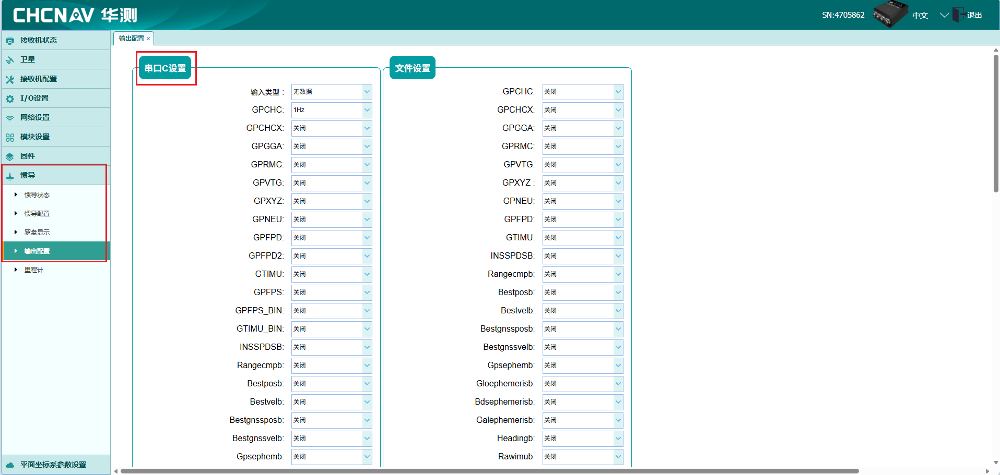
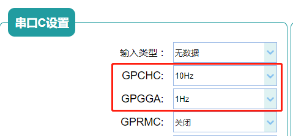
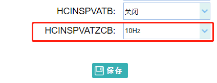

> **带宽注意**：串口带宽 ≈ 波特率/10 字节每秒（460800 波特率约 46080 B/s）。若开启协议的总输出带宽超过串口带宽，会出现数据积压延时（收到几秒前的数据）。提高协议频率前请先估算带宽。

### 3.2 TCP

进入 `I/O设置 -> I/O设置`，在 `TCP Server/NTRIP Caster` 中开启所需协议。

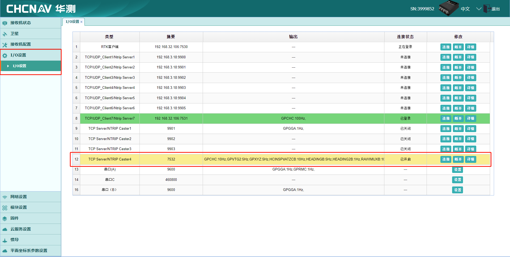
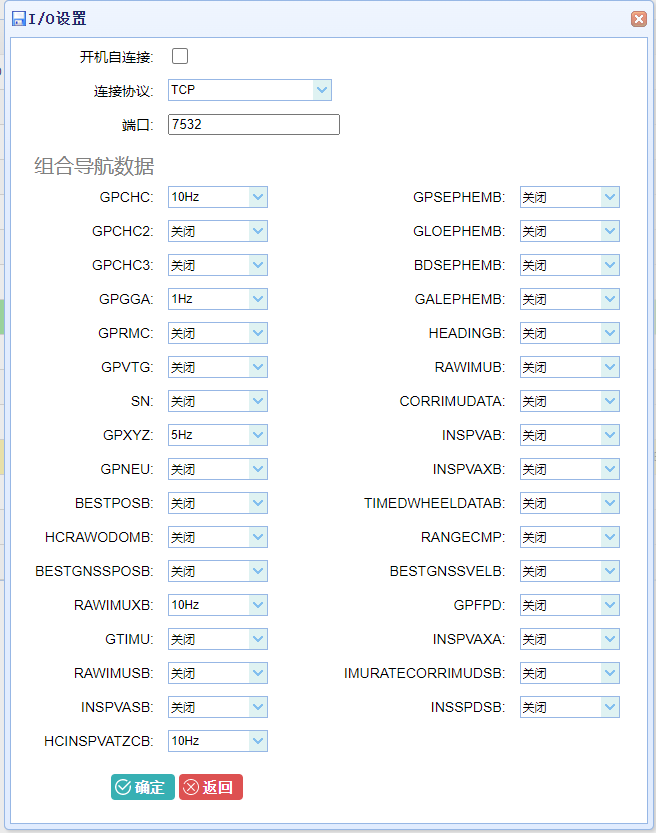

### 3.3 UDP

进入 `I/O设置 -> I/O设置`，在 `TCP/UDP_Client/NTRIP Server` 中开启所需协议。端口号自定，**IP 填写运行 ROS2 的 PC 的地址**。

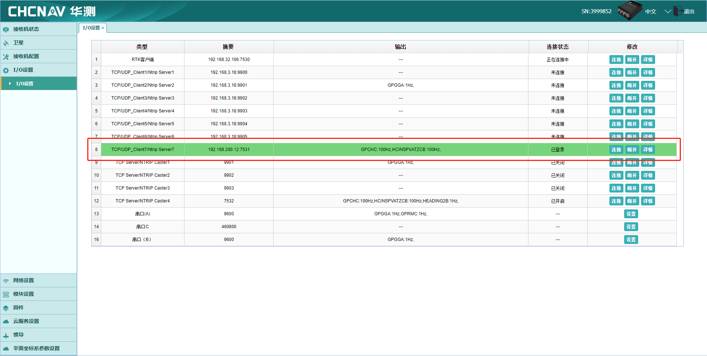
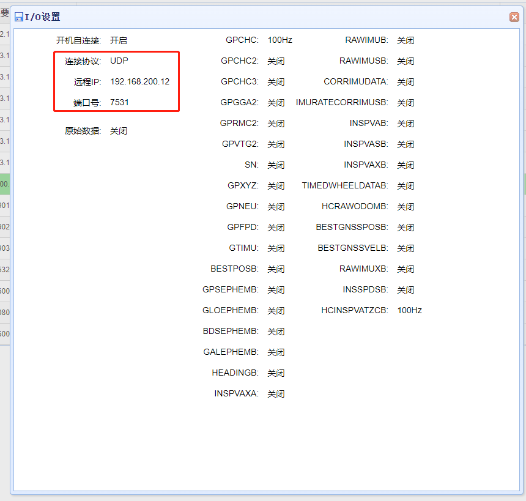
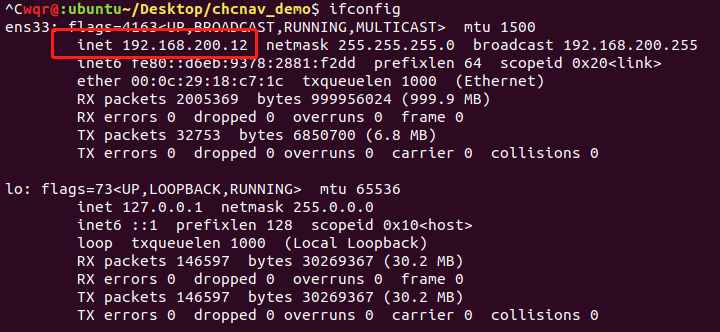

### 3.4 CAN

进入 `惯导 -> 输出配置`，在 **CAN ID设置** 中开启所需协议。

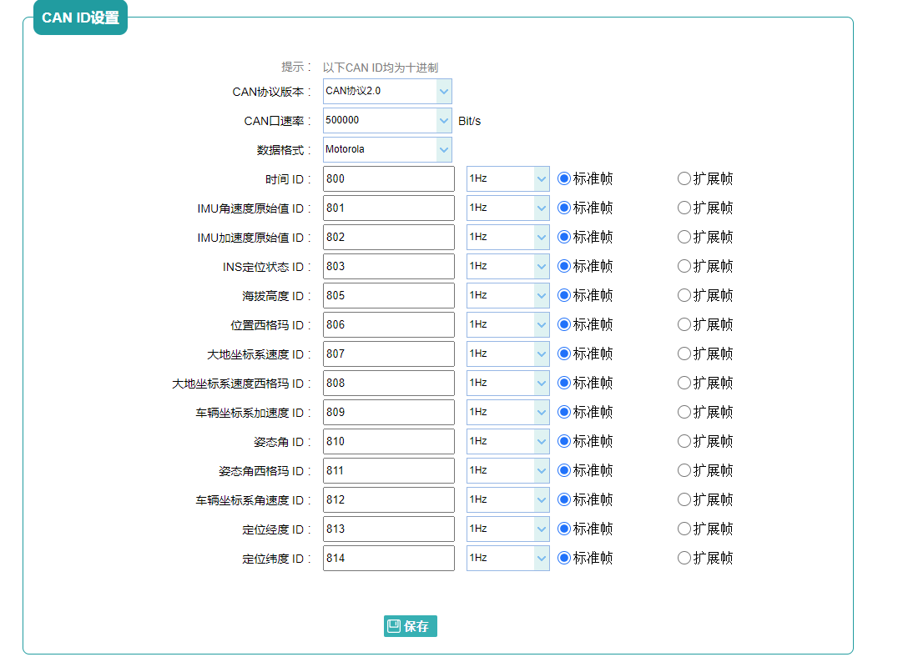

---

## 4. 运行示例（demo）

`launch/` 下每个 demo 均提供 `xml` 与 `py` 两种格式（`demo_0`、`demo_6` 仅 xml），本章以 xml 为例逐个说明。

### 4.0 节点组成

每个 demo 由以下节点组合而成（节点关系以 `demo_3` 为例）：

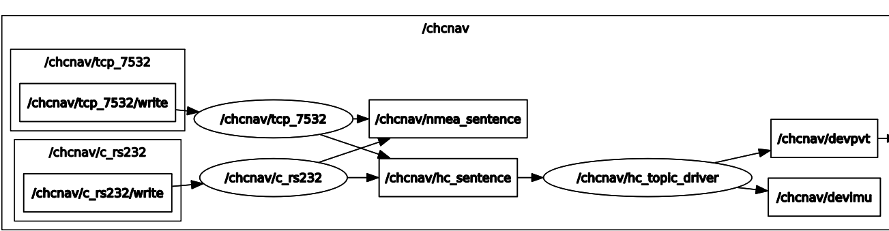

- **HcMsgParserLaunchNode（数据接入 / 分包节点）**：从串口/TCP/UDP/CAN/文件读取混合数据流，按协议分类后发布到 `hc_sentence`、`nmea_sentence`（CAN 方式例外，仅终端打印，见 [4.1](#41-demo_0can)）。通过 `type` 参数选择数据源类型，不同数据源所需参数见各 demo 小节。同时订阅私有话题 `write`（`msg_interfaces/msg/Int8Array`）：向该话题发布的二进制数据会写回串口/TCP 连接的设备（NTRIP 差分下发即依赖此话题）。
- **HcCgiProtocolProcessNode（协议解析节点）**：订阅 `hc_sentence`，对二进制协议做 CRC32 校验后解析，发布 `devpvt`（HCINSPVATZCB）与 `devimu`（HCRAWIMUIB）。无参数，直接声明即可。
- **NtripServerLaunchNode（NTRIP 节点）**：仅 demo_6 使用。

所有 `HcMsgParserLaunchNode` 均支持两个通用参数：

| 参数名 | 类型 | 默认值 | 描述 |
| --- | --- | --- | --- |
| `type` | string | 无 | `serial` / `tcp` / `udp` / `can` / `file` |
| `rate` | int | 1000 | 每秒解析协议的最大数量 |

> **节点命名限制**：`name` 不要以大写字母开头、不要包含下划线等特殊字符，否则 `frame_id` 会导致 RViz2 等下游工具报 `Message Filter dropping message` 错误。

### 4.1 demo_0（CAN）

需先按 [3.4 CAN](#34-can) 配置设备。

> **重要声明**：
>
> 1. **CAN 方式当前不发布 ROS 话题**。与串口/TCP/UDP 不同，CAN 帧的解码结果（位置、姿态、速度等）仅以日志形式打印在终端，`/chcnav/hc_sentence`、`/chcnav/devpvt` 等话题**不会有数据**。如需通过话题获取数据，请使用串口/TCP/UDP 接入方式。
> 2. `dev` 参数须为 **SocketCAN 网络接口名**（即 `ip link` 中可见的 `can0`/`vcan0` 等），不支持其它设备节点。USB-CAN 适配器需自带内核 SocketCAN 驱动；仅提供用户态 API 的适配器无法直接使用。

```xml
<launch>
    <!-- hc_cgi_protocol_process_node -->
    <node pkg="chcnav" exec="HcCgiProtocolProcessNode" name="hc_topic_driver" output="screen"/>

    <!-- hc_msg_parser_launch_node  -->
    <node pkg="chcnav" exec="HcMsgParserLaunchNode" name="CAN" output="screen">
        <!-- CAN settings -->
        <param name="type" value="can"/>
        <param name="dev" value="vcan0"/>                           <!-- CAN设备名称 -->
        <param name="can_rate" value="500000"/>                     <!-- CAN速率 Bit/s -->
        <param name="data_format" value="motorola"/>                <!-- 数据格式 支持 "motorola" or "intel" -->

        <param name="time_id" value="800"/>                         <!-- 时间 ID  -->
        <param name="angrate_rawIMU_id" value="801"/>               <!-- IMU角速度原始值 ID  -->
        <param name="accel_rawIMU_id" value="802"/>                 <!-- IMU加速度原始值 ID  -->
        <param name="sys_status_id" value="803"/>                   <!-- INS定位状态 ID  -->
        <param name="altitude_id" value="805"/>                     <!-- 海拔高度 ID  -->
        <param name="pos_sigma_id" value="806"/>                    <!-- 位置西格玛 ID  -->
        <param name="velocity_level_id" value="807"/>               <!-- 大地坐标系速度 ID  -->
        <param name="velocity_level_sigma_id" value="808"/>         <!-- 大地坐标系速度西格玛 ID  -->
        <param name="accel_vehicle_id" value="809"/>                <!-- 车辆坐标系加速度 ID  -->
        <param name="heading_pitch_roll_id" value="810"/>           <!-- 姿态角 ID  -->
        <param name="heading_pitch_roll_sigma_id" value="811"/>     <!-- 姿态角西格玛 ID  -->
        <param name="angrate_vehicle_id" value="812"/>              <!-- 车辆坐标系角速度 ID  -->
        <param name="longitude_id" value="813"/>                    <!-- 定位经度 ID  -->
        <param name="latitude_id" value="814"/>                     <!-- 定位纬度 ID  -->
        <!-- CAN settings end -->
    </node>

</launch>
```

参数说明：

| 参数名 | 类型 | 默认值 | 描述 |
| --- | --- | --- | --- |
| `dev` | string | 无 | CAN 设备名，如 `can0` / `vcan0` |
| `can_rate` | int | 无 | CAN 速率 Bit/s，如 500000 |
| `data_format` | string | 无 | `motorola` 或 `intel` |
| `time_id` 等各报文 ID | int | 见上方 xml | 各 CAN 报文 ID 映射，与设备端 CAN ID 设置一一对应 |

### 4.2 demo_1（串口）

最常用的入门示例。需先按 [3.1 串口](#31-串口) 配置设备，并完成 [1.3 串口权限](#13-串口权限仅串口方式需要)。

```xml
<launch>
    <!-- hc_cgi_protocol_process_node -->
    <node pkg="chcnav" exec="HcCgiProtocolProcessNode" name="hc_topic_driver" output="screen"/>

    <!-- hc_msg_parser_launch_node  -->
    <node pkg="chcnav" exec="HcMsgParserLaunchNode" name="rs232" output="screen">
        <!-- serial settings -->
        <param name="type" value="serial"/>
        <param name="rate" value="1000"/>         <!-- 节点每秒解析最大协议数量 -->
        <param name="port" value="/dev/ttyUSB0"/> <!-- 串口路径，需根据实际情况修改 -->
        <param name="baudrate" value="460800"/>   <!-- 波特率，需根据实际情况修改 -->
        <!-- serial settings end -->
    </node>

</launch>
```

参数说明：

| 参数名 | 类型 | 默认值 | 描述 |
| --- | --- | --- | --- |
| `port` | string | 无 | 串口路径，如 `/dev/ttyUSB0` |
| `baudrate` | int | 115200 | 波特率，与设备串口配置一致 |
| `databits` | int | 8 | 数据位（一般用默认值） |
| `stopbits` | int | 1 | 停止位（一般用默认值） |
| `parity` | string | None | 校验位 None/Odd/Even（一般用默认值） |

### 4.3 demo_2（TCP）

需先按 [3.2 TCP](#32-tcp) 配置设备。

```xml
<launch>
    <!-- hc_topic_driver -->
    <node pkg="chcnav" exec="HcCgiProtocolProcessNode" name="hc_topic_driver" output="screen"/>

    <!-- hc_msg_parser_launch_node -->
    <node pkg="chcnav" exec="HcMsgParserLaunchNode" name="tcp_7532" output="screen">
        <!-- tcp settings -->
        <param name="type" value="tcp"/>
        <param name="rate" value="1000"/>           <!-- 节点每秒解析最大协议数量 -->
        <param name="host" value="192.168.200.1"/>  <!-- ip 地址，需根据实际情况修改 -->
        <param name="port" value="7532"/>           <!-- 端口号，需根据实际情况修改 -->
        <!-- tcp settings end -->
    </node>

</launch>
```

参数说明：

| 参数名 | 类型 | 默认值 | 描述 |
| --- | --- | --- | --- |
| `host` | string | 无 | 设备 IP 地址（热点模式下通常为 `192.168.200.1`） |
| `port` | int | 无 | 端口号，与设备 TCP 配置一致 |

### 4.4 demo_3（UDP）

需先按 [3.3 UDP](#33-udp) 配置设备。

```xml
<launch>
    <!-- hc_topic_driver -->
    <node pkg="chcnav" exec="HcCgiProtocolProcessNode" name="hc_topic_driver" output="screen"/>

    <!-- hc_msg_parser_launch_node -->
    <node pkg="chcnav" exec="HcMsgParserLaunchNode" name="udp_7531" output="screen">
        <!-- udp settings -->
        <param name="type" value="udp"/>
        <param name="rate" value="1000"/>           <!-- 节点每秒解析最大协议数量 -->
        <param name="port" value="7531"/>           <!-- 端口号，需根据实际情况修改 -->
        <!-- udp settings end -->
    </node>

</launch>
```

参数说明：

| 参数名 | 类型 | 默认值 | 描述 |
| --- | --- | --- | --- |
| `port` | int | 无 | 监听端口号，与设备 UDP 配置中填写的端口一致（无需 `host` 参数） |

### 4.5 demo_4（TCP + 串口混合）

多数据源并行接入：需同时完成设备的 TCP 与串口配置。不同解析节点的数据发布到同一话题，通过节点 `name`（即消息的 `frame_id`）区分来源。除本例的 TCP + 串口外，也可按同样方式追加更多节点。

```xml
<launch>
    <!-- hc_topic_driver -->
    <node pkg="chcnav" exec="HcCgiProtocolProcessNode" name="hc_topic_driver" output="screen"/>

    <!-- tcp -->
    <node pkg="chcnav" exec="HcMsgParserLaunchNode" name="tcp_7532" output="screen">
        <param name="type" value="tcp"/>
        <param name="rate" value="1000"/>
        <param name="host" value="192.168.200.1"/>
        <param name="port" value="7532"/>
    </node>

    <!-- rs232 -->
    <node pkg="chcnav" exec="HcMsgParserLaunchNode" name="rs232" output="screen">
        <param name="type" value="serial"/>
        <param name="rate" value="1000"/>
        <param name="port" value="/dev/ttyUSB0"/>
        <param name="baudrate" value="460800"/>
    </node>

</launch>
```

### 4.6 demo_5（文件离线解析）

解析事先录制的协议原始数据文件，并将解析结果记录到 `install/chcnav/lib/chcnav/xxx_sentence_record` 文件中。

```xml
<launch>
    <node pkg="chcnav" exec="RecordMsgToFile" name="record_msg_to_file" output="screen"/>

    <!-- hc_topic_driver -->
    <node pkg="chcnav" exec="HcCgiProtocolProcessNode" name="hc_topic_driver" output="screen"/>

    <!-- hc_msg_parser_launch_node -->
    <node pkg="chcnav" exec="HcMsgParserLaunchNode" name="file" output="screen">
        <!-- file settings -->
        <param name="type" value="file"/>
        <param name="rate" value="1000"/>                 <!-- 节点每秒解析最大协议数量 -->
        <param name="path" value="/path/to/record.txt"/>  <!-- 协议文件绝对路径，需根据实际情况修改 -->
        <!-- file settings end -->
    </node>

</launch>
```

参数说明：

| 参数名 | 类型 | 默认值 | 描述 |
| --- | --- | --- | --- |
| `path` | string | 无 | 协议原始数据文件的绝对路径 |

> 注意：需在终端按 `Ctrl+C` 关闭进程后才能获取完整的记录文件。

### 4.7 demo_6（串口 + NTRIP 辅助固定）

当设备自身无法联网时，可由 PC 端代理差分数据：驱动接收设备输出的 GGA 上传至 NTRIP 服务器，并将服务器返回的差分数据经串口下发给设备，完成 RTK 固定。

```xml
<launch>
    <!-- hc_msg_parser_launch_node  -->
    <node pkg="chcnav" exec="HcMsgParserLaunchNode" name="c_rs232" output="screen">
        <param name="type" value="serial"/>
        <param name="rate" value="1000"/>
        <param name="port" value="/dev/ttyUSB0"/>
        <param name="baudrate" value="115200"/>
    </node>

    <!-- hc_cgi_protocol_process_node -->
    <node pkg="chcnav" exec="HcCgiProtocolProcessNode" name="hc_topic_driver" output="screen"/>

    <!-- ntrip_server -->
    <node pkg="chcnav" exec="NtripServerLaunchNode" name="ntrip_server" output="screen">
        <param name="frame_id" value="c_rs232"/>          <!-- 与解析节点 name 一致 -->

        <param name="login_type" value="third_cors"/>

        <param name="host" value="119.3.136.126"/>
        <param name="port" value="8002" type="str"/>
        <param name="mountpoint" value="RTCM33"/>
        <param name="username" value=""/>
        <param name="password" value="" type="str"/>

        <remap from="/differential_data" to="/write"/>
        <remap from="/ntrip_source" to="/chcnav/nmea_sentence"/>
    </node>

</launch>
```

**话题**：

- 订阅 `ntrip_source`（`msg_interfaces/msg/String`）：GGA 数据来源，通常 remap 自 `/chcnav/nmea_sentence`
- 发布 `differential_data`（`msg_interfaces/msg/Int8Array`）：差分数据，需 remap 到解析节点的 `write` 话题以写回设备

`ntrip_server` 节点必须配置 `frame_id` 参数（指定 GGA 消息来源的 `frame_id`，需与解析节点 `name` 一致），登录方式使用第三方 CORS（`login_type = third_cors`），所需参数见上方 launch 示例。

### 4.8 demo_7 / demo_8（时间均匀度测试）

分别对 TCP（demo_7）、串口（demo_8）数据做发布间隔稳定性测试，用于检测丢包、校验失败、传输延迟。launch 结构与 demo_2 / demo_1 相同，仅额外增加一个记录节点：

```xml
<node pkg="chcnav" exec="TimeUniformityNode" name="time_uniformity_node" output="screen"/>
```

测试步骤与结果分析见 [附录 B](#附录-b时间均匀度测试)。

### 4.9 demo_9（串口 + fix/imu 转换）

`demo_9` 将 `devpvt` 转换为标准的 `sensor_msgs/msg/Imu` 与 `sensor_msgs/msg/NavSatFix`，源码见 `src/demo/ChcnavFixDemo.cpp`。发布的 `/fix`、`/imu` 话题的字段说明与输出示例见 [2.5](#25-fix仅-demo_9)、[2.6](#26-imu仅-demo_9)。

```xml
<launch>
    <!-- hc_cgi_protocol_process_node -->
    <node pkg="chcnav" exec="HcCgiProtocolProcessNode" name="hc_topic_driver" output="screen"/>

    <!-- hc_msg_parser_launch_node  -->
    <node pkg="chcnav" exec="HcMsgParserLaunchNode" name="rs232" output="screen">   <!-- name命名不要用大写字母开头, 不要带特殊字符，如"_" -->
        <param name="type" value="serial"/>
        <param name="rate" value="1000"/>
        <param name="port" value="/dev/ttyUSB0"/>
        <param name="baudrate" value="460800"/>
    </node>

    <node pkg="chcnav" exec="ChcnavFixDemo" name="chcnav_fix_demo" output="screen"/>
</launch>
```

同时发布静态 TF：`map -> chcnav -> rs232`（供 RViz2 显示使用）。

**RViz2 可视化**：

```shell
sudo apt install ros-galactic-imu-tools # RViz2 显示 Imu 消息需要该插件
ros2 run rviz2 rviz2                    # Add -> Imu，Topic 选择 /imu
```

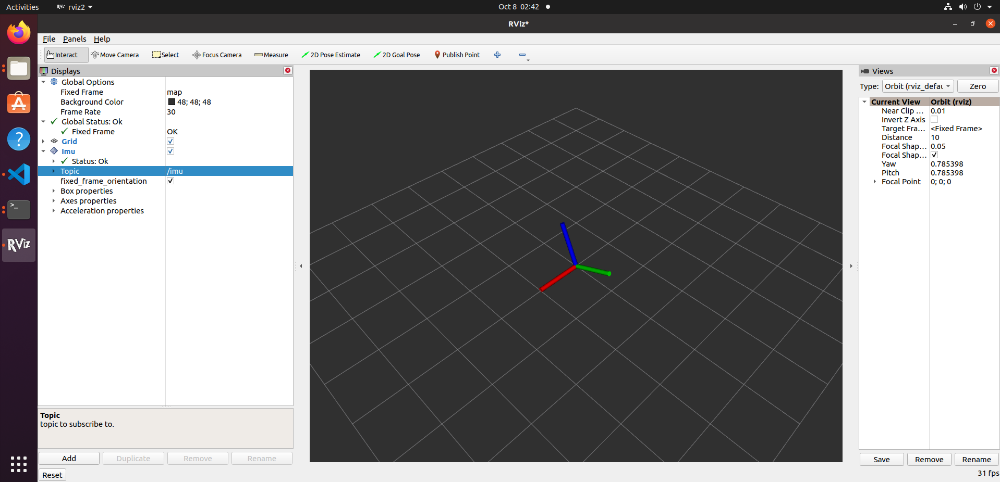

---

## 5. 坐标系与角度约定

`devpvt` 中存在三个易混淆的航向角，约定不同：

| 字段 | 含义 | 取值范围 | 方向约定 |
| --- | --- | --- | --- |
| `yaw` | 组合航向（默认车体系） | (-180, +180] | 右手定则，逆时针为正 |
| `heading` | 速度航向（航迹角） | [0, 360) | 顺时针为正 |
| `heading2` | 组合航向（车体系，卫导模式输出双天线航向，组合模式输出组合航向） | [0, 360) | 顺时针为正 |

> 注意：驱动发布的自定义消息角度单位为 **deg**，与 REP-103（rad、ENU）不一致；转换为标准 `sensor_msgs/Imu`、`sensor_msgs/NavSatFix` 的做法见 [4.9 demo_9](#49-demo_9串口--fiximu-转换)。

---

## 6. 时间戳说明

- `nmea_sentence`、`hc_sentence`：`header.stamp` 为**系统接收时间**。
- `devpvt`、`devimu`：`header.stamp` 为协议内的 **GPS 时间**（非系统时间），换算公式：

```
ros_time = gps_week * 7 * 24 * 3600 + gps_seconds + 315964800 - leaps
```

其中 `315964800` 为 GPS 时间起点（1980-01-06）与 Unix 时间起点（1970-01-01）的秒差，`leaps` 为闰秒数（从 HCINSPVATZCB 协议中动态读取，非硬编码）。实现见 `src/hc_cgi_protocol_process_node/HcCgiProtocolProcessNode.cpp`。

---

## 7. 常见问题排查

**`ros2 topic list` 看不到 /chcnav 话题** → launch 未成功启动，检查编译是否成功、当前终端是否已执行 `source install/setup.bash`（每个新开的终端都需要 source；`/fix`、`/imu` 等标准消息话题不受影响，但 `/chcnav` 下的自定义消息话题必须 source 后才能订阅）。

**`nmea_sentence` / `hc_sentence` 内容显示不全（末尾 `...`）** → `ros2 topic echo` 默认截断超过 128 字符的字符串和超过 16 个元素的数组，属显示行为，数据本身完整；加 `--full-length`（简写 `-f`）参数查看全文。

**话题无数据** → 驱动未收到设备数据：

1. 检查设备端协议输出配置（[3. 设备端配置](#3-设备端配置) 的推荐配置）；
2. 用第三方工具（如 `cutecom`、`nc`）确认串口/TCP 链路本身有无数据；
3. 串口方式确认设备路径与访问权限，并确认串口未被其他程序占用（被占用时终端会报 `IO Exception`）。

**`devpvt` 无数据但 `hc_sentence` 有数据** → 设备未开启 `HCINSPVATZCB` 协议输出，或 CRC 校验失败（终端会打印 `crc32 check failed!`）。

**收到的数据延时数秒** → 串口带宽不足，降低协议输出频率或提高波特率（见 [3.1 串口](#31-串口) 的带宽计算）。

**CAN 方式（demo_0）话题无数据** → 属正常现象：CAN 方式解码结果仅打印在终端，不发布话题，见 [4.1](#41-demo_0can) 的声明。

**CAN 方式反复报 `socket error: Address family not supported by protocol`** → 运行环境内核不支持 SocketCAN（典型如 WSL2 默认内核），请在实体 Linux 机器上运行，并确认 `ip link` 中可见 CAN 接口。

**串口高频（100Hz）输出时间不均匀** → 受 USB 串口驱动 `latency_timer` 限制：

```shell
cat /sys/bus/usb-serial/devices/ttyUSB0/latency_timer   # 查看当前值（默认 16ms）
sudo sh -c 'echo 1 > /sys/bus/usb-serial/devices/ttyUSB0/latency_timer'   # 设为 1ms 后重启驱动
```

---

## 附录

### 附录 A：ROS2 Galactic 环境搭建

参考 [ROS2 Galactic 官方文档](https://docs.ros.org/en/galactic/Installation/Ubuntu-Install-Debians.html)。国内网络建议使用清华镜像源：

```shell
sudo apt update && sudo apt install locales
sudo locale-gen en_US en_US.UTF-8
sudo update-locale LC_ALL=en_US.UTF-8 LANG=en_US.UTF-8

sudo apt install software-properties-common curl gnupg2 lsb-release
sudo add-apt-repository universe
sudo curl -sSL https://raw.githubusercontent.com/ros/rosdistro/master/ros.key -o /usr/share/keyrings/ros-archive-keyring.gpg
echo "deb [arch=$(dpkg --print-architecture) signed-by=/usr/share/keyrings/ros-archive-keyring.gpg] http://mirror.tuna.tsinghua.edu.cn/ros2/ubuntu $(lsb_release -cs) main" | sudo tee /etc/apt/sources.list.d/ros2.list > /dev/null

sudo apt update && sudo apt install ros-galactic-desktop python3-argcomplete
echo "source /opt/ros/galactic/setup.bash" >> ~/.bashrc && source ~/.bashrc
```

### 附录 B：时间均匀度测试

用于评估话题消息发布间隔的稳定性（检测丢包、校验失败、传输延迟）。

**原理**：记录相邻两条消息的时间差，挂机一段时间后绘图并统计 max/min/average。

```shell
# 1. 运行测试节点（tcp 用 demo_7，串口用 demo_8），挂机一段时间后 Ctrl+C
ros2 launch ./src/chcnav/launch/demo_7.xml

# 2. 记录文件生成于 install/chcnav/lib/chcnav/***_time_record

# 3. 绘图（需 python3 + numpy + matplotlib）
cd src/chcnav/scripts
./uniformity_process.py ../../../install/chcnav/lib/chcnav/nmea_time_record
# 输出图片：同目录 ***_time_record.PNG
```

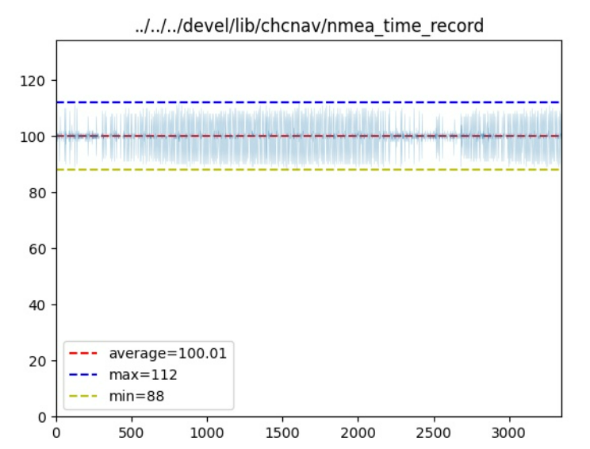

**结果解读**：

- `average`：平均间隔（ms），`1000/average` 即实际频率；`max`/`min` 为最大/最小间隔。
- `hc_time_record`、`nmea_time_record` 记录的是**接收时间**，受网络/串口读取延迟影响。
- `devpvt_time_record`、`devimu_time_record` 记录的是协议内 **GPS 时间**，不受传输延迟影响——三值相等说明无丢包、无校验失败；出现波峰即为丢包，如下图丢包 1 次、丢 `(40-10)/10 = 3` 包：

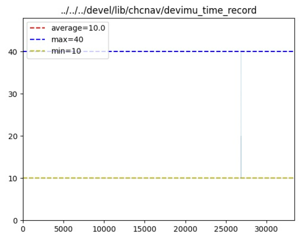
